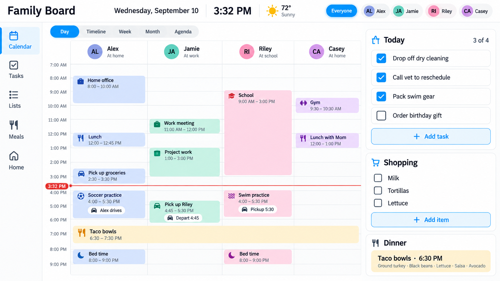

# Moran Family Board Card

**English** · [Deutsch](README.md)

[New agent? Start with HANDOFF.md](HANDOFF.md) · [Development](docs/DEVELOPMENT.md) ·
[Backlog](docs/BACKLOG.md) · [Research](docs/research/README.md)

The working calendar project is on `feature/moran-foundation`. The active pilot is read-only.
Images below show upstream/historical concepts, not the latest accepted calendar UI.

[Project documentation](docs/README.md) · [Decisions and discussions](docs/DECISIONS.md) ·
[Current status and next work](docs/STATUS.md) · [Implementation ADR](docs/adr/0001-implementation-base.md)


This is the Moran-maintained fork of
[`renespeaker/ha-family-board-card`](https://github.com/renespeaker/ha-family-board-card).
It preserves the upstream calendar views while adding configurable event routing for households
that keep events in shared managed calendars instead of one calendar per person.



A family calendar — a “who is where, when” board — for [Home Assistant](https://www.home-assistant.io/). People are columns across the top (with the avatar from their `person.*` entity), time runs down the left. The card shows at a glance which activities happen at the same time in different places — for up to 10 people.

- **Day view** – people as columns, a shared time axis, now line; **overlapping events** are placed side by side.
- **Week view** – weekdays as rows, people as columns, compact event chips.
- **Month view** – classic month grid with colored events per person; clicking a day jumps into the day view.
- **Agenda / list view** – chronological list of events grouped by day; ideal on a phone.
- **Status tiles** (`show_focus`) in wall mode separate **Free now / Busy now** from the
  next timed appointment, with Today/Tomorrow/an explicit date and time kept visible.
  Incomplete data never implies free. “Next” is limited to the loaded range, not to today;
  all-day events do not mark someone busy. Legacy layout keeps current-or-next behavior. See
  [current rules and known limitations](docs/STATUS.md#status-tiles-current-rules-and-known-issue).
- **Auto icons** – optionally every event gets a matching emoji by keyword (doctor → 🩺, sport → 🏃, birthday → 🎂, school → 🎒 …); custom rules possible. Titles that already contain an emoji stay untouched.
- **Timeline view** – people as rows on the left, time running horizontally: events as bars on a timeline (Gantt style); overlapping events stack into sub-rows.
- **Pick your views** – choose in the editor which switchers (day/timeline/week/month/agenda) appear.
- **Week navigation** – page back and forth, a click on the date range jumps back to “today”.
- **Theme-aware** – picks up the colors and fonts of the active dashboard theme (uses HA CSS variables throughout).
- **Configurable** – 15/30/60 min grid, day window, weekend on/off, color by person or location, auto refresh.
- **Drag & drop** – in the day view, drag events to move them (time) and drag the bottom edge to change the duration; snaps to the time grid and writes straight back to the calendar – **only** for writable calendars and single events (no series).
- **Manage events** – create/edit/delete right in the card, **but only** for calendars that support it (Local Calendar, CalDAV …). Read-only calendars (e.g. ICS subscriptions) are detected automatically and shown read-only. Recurring events: choose **“this event only / this and following”**.
- **Several calendars per person** – e.g. work + private in one column (selectable in the editor).
- **Shared-calendar routing** – route events into person lanes by title prefix, contained text, or
  regular expression without creating duplicate calendars.
- **Household fallback lane** – an `unmatched` lane receives events that no configured person rule
  claimed.
- **Clean lane titles** – optionally remove a matched person prefix while preserving a leading
  semantic marker, so `⭐️ Avery: Concert` can display as `⭐️ Concert` inside Avery's lane.
- **Robust event logic** – all-day events (exclusive end), events across midnight and multi-day events are split onto the correct days; time zones are respected.
- **Multilingual & localized** – texts in English/German, weekday names and clock format (12/24 h) from the HA locale; relative days (“Today/Tomorrow”).
- **Everyday polish** – past events dimmed, coloring by calendar, open a location straight in the maps app, hide noisy events by pattern.
- **Live progress & countdown** – running events show a progress bar (can be turned off), upcoming ones show “in 20 min” in the agenda; updates every minute.
- **Weather** – icon + temperature per day from a `weather.*` entity in the day/agenda header (HA location, not the event address).
- **Busy days stay readable** – if more events overlap than `max_columns` allows, extra columns collapse into a “+N” chip instead of unreadable slivers. It opens Agenda when enabled; wall Day uses a person/day list when Agenda is disabled.
- **Long events as a background band** – long-running events (after-school care, “free play”) beyond a configurable length run as a subtle full-width band behind the column instead of squeezing the short events sideways. The real appointments get the full width.
- **Auto-fit height** – optionally the day view adapts to the available card height so that start–end hour are fully visible without scrolling (ideal for wall tablets / kiosk).
- **Fills the screen** – person columns grow with the card width (panel view / wide cards); with `full_height` the board reaches the bottom of the screen. Column width, axis width and spacing are configurable.
- **Tentative events** – events whose title matches a `tentative_patterns` pattern are drawn dashed and slightly translucent (opt-in; the calendar status is deliberately not evaluated).
- **Entity badges per person** – any entities (phone battery, sensors …) as small chips below the person header; a click opens the more-info dialog.
- **Kiosk mode** – optionally return to the start view and to “today” after X minutes of inactivity; larger touch targets on touch devices.
- **Visual editor 2.0** – no YAML at all: first-run wizard, one-click profiles (🖥️ wall tablet / 📱 phone / 🧩 default), expandable topic groups with helper texts, palette picker per person **and per calendar** (incl. label), fine-tuning sliders (font size, corner radius, opacity) – fields only appear when the matching view is active.
- **⚡ Zero-config start** – when added, the card detects all `person.*` entities and links matching calendars by name; you can re-run it any time via “✨ Detect automatically” in the editor.
- **Person toggle** – clicking a person header hides that person temporarily (the column collapses to the avatar); a second click brings it back. Works in every view.
- **Event clean-up** – allow list (`show_patterns`), title replacement (`replace_patterns`, `"search => replacement"`) and duplicate filter (`filter_duplicates`, the same event in several calendars only once).
- **Multi-day events** – segments show “(2/5)” so it is clear which day of the run this is.
- **Calendar mapping** – with `calendars:` every calendar gets a fixed color, its own label, an **mdi icon** in front of the title and optionally a different **title field**.
- **Title from another field** – school timetable feeds often put the subject into `description` while `summary` only says “Homeroom”: `title_field: description` finally shows “Maths” instead of the same text three times.
- **Free choice of map link** – `map_url` with the `{location}` placeholder (Google Maps, Apple Maps, OpenStreetMap …), the default stays Google Maps.
- **Compact mode** – one switch (`compact`) for smaller fonts and tighter spacing instead of adjusting three sliders.
- **People hidden on start** – `hidden: true` per person; the column starts collapsed and a click on the header brings it back.

> Fork status: **daily-use calendar development fork, based on upstream v0.25.**
> The wall layout and read-only calendar integration are installed in a private Home Assistant
> pilot. This is a development checkpoint, not a published HACS release. The card reads calendars
> through Home Assistant; it does not connect directly to Calendar Bridge.
> [Current status](docs/STATUS.md) records the latest development build and the separately
> installed HA version. A newer GitHub commit does not update the installed pilot.

### Calendar reliability preview

- Wall Day's **+N** overlap chip stays usable with Agenda disabled: it opens a list of
  that person's selected-day appointments, including full titles and the existing details.
  Closing details returns to the list; closing the list returns to Day without changing
  views or saved preferences. Current-data refresh, failure/retry, keyboard focus and
  scroll context are retained. Enabled Agenda and legacy behavior are unchanged.
- Wall view/date tabs support Left/Right and Home/End to move focus; Enter/Space selects.
  Tab leaves each group, and returning targets its selected option. Off-screen tabs are
  revealed without moving the calendar. Arrow focus alone does not load another view/date.
  Date arrows wrap within the displayed week; use the existing date-navigation buttons
  to page further. Legacy keyboard behavior is unchanged.
- Wall Day and Timeline include **Calendar zoom** behind the header's magnifying glass.
  Move left for more hours or right for more detail. Day changes hour height (40–96px;
  100% = 64px); Timeline changes hour width (48–240px; 100% = 96px), keeping person-row heights.
  Date, visible time and people stay anchored within scroll limits. Reset restores
  `hour_height`/`fit_height` in Day or `hour_width` in Timeline. The views keep independent
  zoom across reloads when `remember_preferences` is enabled (the wall default), scoped
  to this browser and HA user/dashboard/card. Reset clears only the active saved override;
  changing its density defaults invalidates that scale. Opt-out keeps zoom session-only.
  No appointments or scroll/date positions are stored; there is no cross-device sync. Short Day events
  prioritize titles; use details or Agenda for more space. Month, Agenda and legacy have
  no zoom slider. Check STATUS for deployment state.
- Wall Week uses the same zoom popup for list density, 75–150% (default 100%). Move left
  for more events or right for larger text/spacing. Full titles wrap; text stays at least
  12px and appointment targets at least 48px. Pinned headings and person-column widths do
  not scale. Zoom preserves the visible date-row position within scroll bounds. Week saves
  independently with `remember_preferences`; Reset clears only Week and restores 100%.
- Wall Week shows date numbers and readable, wrapping event cards with pinned date/person
  headers. Month and Agenda expose shared person filters. Narrow Month shows unique event
  counts and opens Day when a date is tapped; direct event cards remain when Day is disabled
  or hides weekends. Agenda wraps long titles/locations instead of truncating them.
- Wall Month's **+N more events** expands that date's remaining appointment cards in place;
  **Show less** collapses them. Expanded titles wrap, and each card opens the usual details.
  One date expands at a time; expansion is not saved. Narrow cards without a valid Day
  drilldown pan a wider, readable month grid. Hidden weekend dates no longer jump to a
  weekday. Date totals count unique events; overflow counts the rendered person-owned cards.
- Wall views keep the browsing date when switching between Day, Timeline, Week, Month,
  and Agenda. Month navigation carries the preferred day into the displayed month,
  clamped to a valid visible date; clicking a date explicitly takes precedence.
  Person filters stay intact. Legacy Month navigation remains independent.
- Wall Day arrows move by one visible day. Swipe/drag the month label beside the dates, or focus it and
  press Left/Right, to page between dates. The event grid still scrolls between people.
  Date changes preserve the visible time and horizontal person position (clamped when
  trimmed hours cannot show the same time); Today explicitly recenters on now.
  Week/Timeline and legacy Day retain week-sized arrows. Date-strip scrolling alone
  does not select a date. See [current delivery state](docs/STATUS.md).
- The wall header stays one 48px row with a maximum 40px view capsule. Long titles truncate;
  the current time follows the configured title with a 12px gap, using HA's 12/24-hour
  preference and the existing minute tick. Narrow multi-view layouts omit the title/clock
  and let the capsule scroll horizontally if needed; single-view cards retain both.
  The full board name remains accessible. Status tiles (`show_focus: true`) start collapsed
  behind the people/disclosure button. Opening them preserves Day's visible time; expansion
  lasts through view changes but resets on a fresh card/config, without a stored preference.
- Wall Day/Timeline no longer have a separate heading row: month/year, Today and paging
  share the date strip. Weekday and number center within a shared 40px group, kept 12px
  from the cell's left edge, with proportional, normally spaced numbers.
- Wall Timeline fills the remaining panel with growing person rows and bars. Overlaps
  retain readable minimum sizes; short panels scroll. Today's Timeline opens near now,
  and Today recenters it. Refreshes and resizing preserve manual time browsing.
- The installed wall pilot includes separate availability/next-event Status tiles, a Today
  action that recenters on now, browser-local view/person preferences, separated date cells,
  and a neutral segmented view switcher. See [verification and remaining work](docs/STATUS.md).
- Wall Day headers, all-day cells, and timed columns resize together for any number
  of people. Hidden lanes collapse to the same width in every row; narrower panels
  scroll the aligned grid horizontally instead of squeezing headers independently.
- `read_only: true` keeps event details and navigation while blocking create, edit, delete,
  and drag changes, including stale action handlers. It is a card behavior guard, not a
  substitute for Home Assistant permissions.
- Open read-only details refresh with their source occurrence. Unverifiable or missing
  events retain an explicit warning instead of silently presenting old details as current.
  Editable drafts are never overwritten by a background read.
- Calendar failures and unavailable sources are visible; incomplete reads never mean
  everyone is free. Healthy sources remain usable when another source fails.
- Periodic refresh picks up changed or removed appointments. Focus, page restoration,
  and connection recovery refresh automatically; overlapping requests share one read.
  Responses from an old view, suspended page, or detached card cannot replace newer data.
- All-day dates use exclusive ends, day segmentation follows local calendar dates across
  daylight-saving changes, and shared appointments retain each intended person's copy.

Run `npm run test:harness` after building for rendered checks with synthetic calendars,
including connection recovery and phone-width scenarios. Physical iOS sleep/wake and
provider-to-HA synchronization latency still require real-device validation. Mobile
date paging and the broader Fantastical-inspired interaction pass remain follow-up work;
the Day grid already keeps its left time axis pinned during person-lane scrolling.

The private pilot now uses a full 24-hour range with initial scroll to now. To use the
same display behavior, add these options to an otherwise configured card:

```yaml
start_hour: 0
end_hour: 24
trim_hours: false
scroll_to_now: true
```

This does not change the package's 6–22 defaults or make the Today action always recenter
an already visited date. [STATUS.md](docs/STATUS.md) tracks that open behavior separately.

## Installation (HACS custom repository)

1. Open HACS → three-dot menu → **Custom repositories**.
2. Add `https://github.com/emilianomoran/moran-family-board-card` as a **Dashboard** repository.
3. Install **Moran Family Board Card**.
4. Add `type: custom:moran-family-board-card` to a dashboard, or select the card in the picker.

### Manually (quick test without HACS)

Copy `dist/moran-family-board-card.js` to `config/www/` and add it as a resource:

```yaml
url: /local/moran-family-board-card.js
type: module
```

## Configuration

```yaml
type: custom:moran-family-board-card
title: Family Board # optional, custom card title
view: day           # day | timeline | week | month | agenda
time_grid: 30       # 15 | 30 | 60
start_hour: 6
end_hour: 22
show_weekends: true
show_now_line: true
color_by: person      # person | location | calendar
hour_height: 64       # pixels per hour (40–96), day view
refresh_interval: 300 # seconds; 0 = off
persons:
  - name: Avery
    person: person.fixture_avery        # avatar (entity_picture) + live status
    calendar: calendar.fixture_avery    # source of the events
    color: '#8B7CF6'        # optional, otherwise the default palette
  - name: Jordan
    person: person.fixture_jordan
    calendar:               # several calendars per person are possible
      - calendar.fixture_jordan_work
      - calendar.fixture_jordan_private
```

To try the calendar-first full-panel proof, add `layout: wall`. Omitting `layout` keeps the
existing card and all current behavior. Wall currently starts as a calendar-only Day proof; its
other views remain functional but do not yet claim final wall styling.

```yaml
type: custom:moran-family-board-card
layout: wall
view: day
persons:
  - name: Avery
    person: person.fixture_avery
    calendar: calendar.fixture_family
```

### Shared managed calendars

The same calendar can be assigned to several lanes. A lane with matching rules receives only the
events it claims; an `unmatched` lane receives the remaining household-wide events.

```yaml
type: custom:moran-family-board-card
persons:
  - name: Person A
    calendar:
      - calendar.fixture_family
      - calendar.fixture_activities
    match_title_prefixes:
      - "Person A:"
    strip_title_prefix: true
  - name: Person B
    calendar:
      - calendar.fixture_family
      - calendar.fixture_activities
    match_title_prefixes:
      - "Person B:"
      - "Person B + Person C:"
    strip_title_prefix: true
  - name: Household
    calendar:
      - calendar.fixture_family
      - calendar.fixture_activities
    unmatched: true
```

Prefix matching is case-insensitive and ignores leading symbols, so a rule such as `Person A:` also
matches `⭐️ Person A: Concert`. Contains and regular-expression routing are available through
`match_title_contains` and `match_title_regex`. Invalid regular expressions are ignored instead of
breaking the calendar. When no explicit rule already claims it, a joint title such as
`Person A + Person B: Concert` also reaches both lanes when each lane has its own `Person A:` or
`Person B:` prefix. Every named owner must resolve; otherwise the event goes to the configured
`unmatched` lane.

Each configured calendar is requested once per visible range and refresh. Missing or failed sources
show a warning without hiding events from healthy sources; a source that appears later is loaded on
the next Home Assistant state update. Every view shows loading and failure status with a Retry
button after failure. Reads time out after 20 seconds; the default refresh interval also retries
API failures every five minutes. Switching ranges clears the old range's events while loading;
late responses cannot overwrite a newer selection. The minute clock follows Today across midnight
and loads a new week when needed, while keeping an intentionally browsed date anchored.
Malformed records are isolated from valid events in the same response. An incomplete-data warning
remains visible until the feed recovers; a response containing only invalid records never appears
as a healthy empty calendar. Impossible dates and reversed durations are rejected rather than
silently shifted into a different appointment.
All-day dates use Home Assistant's exclusive end-date convention, and local calendar-day
boundaries stay correct across daylight-saving changes.
With `filter_duplicates`, mirrored copies are collapsed within an owner lane, but a joint event
still retains every owner and separate recurring occurrences remain distinct. The optional
now/next bar does not claim a lane is "free" when its calendars are unavailable or the displayed
range does not cover the current time.
Title prefixes, replacements, and alternate display fields are presentation only: editing or
moving an event preserves its original calendar title unless the user changes the title in the
editor. Recurring instances require the edit dialog's recurrence scope and cannot be dragged.

| Option | Type | Default | Description |
|--------|------|---------|-------------|
| `persons` | list | – | 1–10 lanes with `name`, optional `person`, `calendar` (string **or list**), routing rules, `color`, `badges`, and `hidden` |
| `match_title_prefixes` | list | – | Route titles beginning with one of these values; leading symbols and emoji are ignored |
| `match_title_contains` | list | – | Route titles containing one of these case-insensitive values |
| `match_title_regex` | list | – | Route titles matching any case-insensitive regular expression; invalid expressions are ignored |
| `unmatched` | boolean | `false` | Use the lane as a fallback for events from its calendars that no normal lane claimed |
| `strip_title_prefix` | boolean | `false` | Remove the matched configured prefix from the displayed event title |
| `hide_empty_persons` | boolean | `false` | Week view: hide people without events in that week |
| `show_focus` | boolean | `false` | Enables Status tiles; wall mode places them behind a collapsed-by-default header toggle and separates current availability from the dated next appointment. Legacy remains always visible when enabled. |
| `read_only` | boolean | `false` | Disable creating, editing, deleting, and dragging events in this card; details and navigation remain available. This is a card behavior setting, not an HA permission boundary. |
| `drag_drop` | boolean | `true` | Move / resize events in the day view by dragging (writable single events only) |
| `auto_icons` | boolean | `false` | Prepend an emoji per event based on keywords |
| `icon_patterns` | list | – | Custom icon rules, e.g. `["Grandma => 👵"]` |
| `auto_return` | number | `0` | Kiosk: return to the start view / today after X minutes without a touch (0 = off) |
| `title` | string | – | Custom card title (default: localized “Family board”) |
| `layout` | string | absent / existing | Set to `wall` for the opt-in calendar-only full-panel Day proof; omitting it preserves existing behavior |
| `view` | string | `day` | Start view: `day`, `timeline`, `week`, `month` or `agenda` |
| `views` | list | all | Which views appear in the switcher, e.g. `[day, agenda]` |
| `remember_preferences` | boolean | `true` for wall, otherwise `false` | Retain selected view, hidden people and independent wall Day/Timeline/Week zoom in this browser for the HA user/dashboard/card. No calendar payloads are stored. Changing lane definitions, enabled views, or view defaults resets the saved choices; changing density defaults resets only that view's zoom. Reset clears its zoom override. Blocked storage falls back to normal unsaved use. |
| `preferences_key` | string | title-based identity | Distinguish otherwise identical cards on the same dashboard path; not a credential or security boundary. |
| `time_grid` | number | `30` | Time axis grid in minutes |
| `start_hour` | number | `6` | First visible hour |
| `end_hour` | number | `22` | Last visible hour |
| `show_weekends` | boolean | `true` | Show Sat/Sun |
| `show_now_line` | boolean | `true` | Current time as a line |
| `color_by` | string | `person` | Color by `person`, `location` or `calendar` |
| `dim_past` | boolean | `true` | Dim events that are already over |
| `hide_patterns` | list | – | Hide events whose title contains one of the patterns (e.g. `["Free", "Private"]`) |
| `show_patterns` | list | – | Allow list: only show events whose title contains one of the patterns |
| `replace_patterns` | list | – | Clean up titles: `"search => replacement"` (without `=>` the text is removed) |
| `filter_duplicates` | boolean | `false` | Show identical events (title + time) only once per person and in the agenda |
| `calendars` | map | – | Per calendar `color`, `label`, `icon` (mdi) and `title_field` (editable in the editor) |
| `compact` | boolean | `false` | Compact layout: smaller fonts and tighter spacing |
| `map_url` | string | Google | Template for the location link, `{location}` is substituted, e.g. `https://maps.apple.com/?q={location}` |
| `event_size` | number | – | Font size of the event titles in px (editor slider, sets `--fb-event-size`) |
| `radius` | number | – | Corner radius of the event blocks in px (sets `--fb-radius`) |
| `past_opacity` | number | – | Opacity of past events in % (sets `--fb-past-opacity`) |
| `show_progress` | boolean | `true` | Progress bar on the running event |
| `weather_entity` | string | – | `weather.*` entity for the daily forecast (HA location) |
| `show_weather` | boolean | `true`* | Show weather in the header (*only takes effect when `weather_entity` is set) |
| `hour_height` | number | `64` | Height of one hour in px (40–96) – scales the day view (wall tablet); with `fit_height` this is the upper bound |
| `hour_width` | number | `96` | Timeline view: width of one hour in px (48–240) |
| `fit_height` | boolean | `false` | Shrink the day view automatically so that start–end hour are fully visible without scrolling (wall tablet / kiosk) |
| `full_height` | boolean | `false` | Stretch the board to the bottom of the screen (panel / wall tablet view); the default is a 58 % cap |
| `trim_hours` | boolean | `true` | Day view: cut away empty hours at the edges so the busy part of the day gets the full height (min. 6 h window; `start_hour`/`end_hour` stay the outer bounds) |
| `col_min_width` | number | `120` | Minimum width (px) per person column, below that the board scrolls horizontally; above it the columns grow with the card width |
| `background_hours` | number | `3` | Timed events from this length (hrs.) on are drawn as a subtle background band instead of a column; `0` = off |
| `max_columns` | number | `3` | Max. side-by-side columns per person/day; with more overlaps a “+N” chip appears (1–8) |
| `tentative_patterns` | list | – | Mark events with a matching title pattern as tentative (dashed / translucent) |
| `first_day` | string | `monday` | Week starts on `monday` or `sunday` |
| `scroll_to_now` | boolean | `true` | Automatically scroll today's Day or wall Timeline to now after loading. The wall Today action still recenters when this is `false` or the now line is hidden. Ordinary ticks, refreshes and Timeline resizing do not take over manual scrolling. Legacy Timeline is unchanged. |
| `refresh_interval` | number | `300` | Auto refresh of the events in seconds (0 = off); additionally when the tablet wakes up |

Every `calendar.*` entity works – no matter whether `local_calendar` (local, no cloud), Google or CalDAV. Home Assistant delivers them all in the same shape.

## Styling (theme / card-mod)

The card picks up the theme's colors and fonts automatically. For fine-tuning there are additional CSS variables you can override in your **theme** or via **card-mod**:

| Token | Default | Effect |
|-------|---------|--------|
| `--fb-accent` | `--primary-color` | “Today” / accent color |
| `--fb-now-color` | `--error-color` | Now line & progress |
| `--fb-radius` | `7px` | Corners of the event blocks |
| `--fb-radius-sm` | `5px` | Corners of the chips |
| `--fb-avatar-size` | `34px` | Avatar size |
| `--fb-past-opacity` | `0.5` | Opacity of past events |
| `--fb-title-size` | `16px` | Card title |
| `--fb-name-size` | `13px` | Person names |
| `--fb-event-size` | `11.5px` | Event titles |
| `--fb-time-size` | `9.5px` | Times inside a block |
| `--fb-chip-size` | `10.5px` | Chip font size |
| `--fb-hourline` / `--fb-halfhour` / `--fb-row-shade` | – | Grid lines / row shading |
| `--fb-col-min` | `120px` | Minimum width of a person column |
| `--fb-axis-width` | `56px` | Width of the time axis on the left |
| `--fb-board-max-height` | `58vh` | Height cap of the day board (without `full_height`) |
| `--fb-event-pad` | `4px 7px` | Inner padding of the event blocks |
| `--fb-head-pad` | `10px 6px` | Inner padding of the person headers |

Example (card-mod):

```yaml
type: custom:moran-family-board-card
card_mod:
  style: |
    :host {
      --fb-accent: #e91e63;
      --fb-event-size: 13px;
      --fb-radius: 12px;
      --fb-avatar-size: 40px;
    }
persons: …
```

## Languages

The card and the visual editor ship with **English and German**. The language follows your Home Assistant user profile; everything not covered by a translation falls back to English. Dates, weekday names and the clock format (12/24 h) come from the HA locale via `Intl`, so they are correct in every language.

Want another language? Add a dictionary to [`src/localize.ts`](src/localize.ts) (card) and [`src/editor-i18n.ts`](src/editor-i18n.ts) (editor) — both are plain key/value objects, pull requests welcome.

## Development

```bash
npm install
npm run build        # builds dist/moran-family-board-card.js
npm run watch        # rebuild on change
npm run lint         # tsc --noEmit (typecheck)
npm test             # Vitest (event logic)
npm run format       # Prettier
```

Fast loop against a running HA instance: copy `dist/moran-family-board-card.js` to `config/www/` and hard-reload the page.

The error-prone event logic (splitting across midnight, all-day exclusivity, time zones, overlap layout) lives isolated in [`src/events.ts`](src/events.ts) and is covered by [`src/events.test.ts`](src/events.test.ts).

For a local, read-only preview with actual Home Assistant calendar responses, build the card and run `npm run preview:live` with `HA_PREVIEW_URL`, `HA_PREVIEW_TOKEN`, `HA_PREVIEW_CALENDARS` (comma-separated entity IDs), and `HA_PREVIEW_PEOPLE` (comma-separated lane names) set only in the process environment. The page is served on `127.0.0.1:4174` by default. The browser receives event data and configured lane names, but never the Home Assistant token. The preview disables event writes and does not install the card in Home Assistant. Do not commit credentials or household-specific configuration to this repo.

## Creating / editing / deleting events

In the day view, clicking an empty spot in a person's column opens the create dialog (the time is taken from the click position); clicking an event opens it for editing/deleting. Whether that is possible depends on the calendar: the card reads `supported_features` of the respective `calendar.*` entity and hides write actions when the calendar does not support them. Internally the WebSocket commands `calendar/event/create|update|delete` are used (the same ones the native HA calendar panel uses).

## Roadmap

- [x] Create/edit/delete events, only for writable calendars
- [x] Person editor in the visual config editor
- [x] Week navigation & side-by-side layout of overlapping events
- [x] i18n (EN/DE) + locale time format
- [x] Kiosk / wall tablet mode (`full_height`, `fit_height`, `auto_return`, touch targets)
- [x] Mobile layout (compact columns, swipeable)
- [x] Drag & drop to move events
- [x] Available in the official HACS store
- [x] Localized visual editor (EN/DE)
- [ ] Location / conflict detection (e.g. “nobody home”, pick-up gaps)

## License

MIT. The original copyright and license from `renespeaker/ha-family-board-card` are preserved in
[`LICENSE`](LICENSE).
